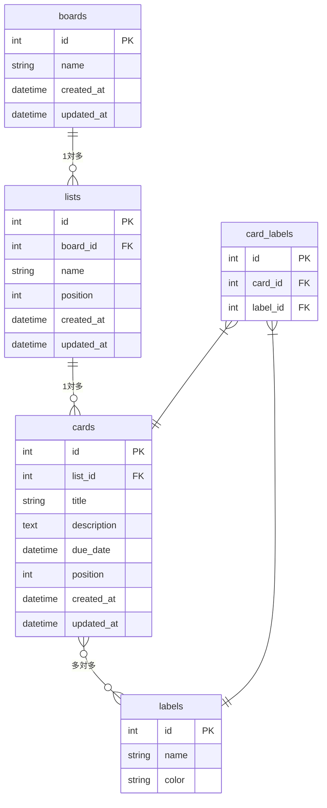

# データベース設計

## テーブル関連図

---

## テーブル定義

### boards（ボード）

| カラム名 | 型 | 制約 | 説明 |
|----------|----|------|------|
| id | INT | PK, AUTO INCREMENT | ボードID |
| name | VARCHAR(100) | NOT NULL | ボード名 |
| created_at | DATETIME | NOT NULL | 作成日時 |
| updated_at | DATETIME | NOT NULL | 更新日時 |

### lists（リスト）

| カラム名 | 型 | 制約 | 説明 |
|----------|----|------|------|
| id | INT | PK, AUTO INCREMENT | リストID |
| board_id | INT | FK → boards.id | 所属ボードID |
| name | VARCHAR(100) | NOT NULL | リスト名 |
| position | INT | NOT NULL | 表示順 |
| created_at | DATETIME | NOT NULL | 作成日時 |
| updated_at | DATETIME | NOT NULL | 更新日時 |

### cards（カード）

| カラム名 | 型 | 制約 | 説明 |
|----------|----|------|------|
| id | INT | PK, AUTO INCREMENT | カードID |
| list_id | INT | FK → lists.id | 所属リストID |
| title | VARCHAR(200) | NOT NULL | カードタイトル |
| description | TEXT | NULL許容 | 説明文 |
| due_date | DATETIME | NULL許容 | 期限日時 |
| position | INT | NOT NULL | リスト内の表示順 |
| created_at | DATETIME | NOT NULL | 作成日時 |
| updated_at | DATETIME | NOT NULL | 更新日時 |

### labels（ラベル）

| カラム名 | 型 | 制約 | 説明 |
|----------|----|------|------|
| id | INT | PK, AUTO INCREMENT | ラベルID |
| name | VARCHAR(50) | NOT NULL | ラベル名 |
| color | VARCHAR(7) | NOT NULL | カラーコード（例：#FF0000） |

### card_labels（カードとラベルの中間テーブル）

| カラム名 | 型 | 制約 | 説明 |
|----------|----|------|------|
| id | INT | PK, AUTO INCREMENT | ID |
| card_id | INT | FK → cards.id | カードID |
| label_id | INT | FK → labels.id | ラベルID |

---

## リレーション補足

| 関係 | 説明 |
|------|------|
| boards → lists | 1つのボードは複数のリストを持つ |
| lists → cards | 1つのリストは複数のカードを持つ |
| cards ↔ labels | 1つのカードは複数のラベルを持てる（中間テーブル `card_labels` で管理） |

---

## 備考

- `position` カラムはドラッグ＆ドロップによる並び替えの順序管理に使用する
- `due_date` は時刻まで保持するため `DATETIME`（Java側は `LocalDateTime`）として実装している
- `labels`・`card_labels` テーブルは設計済みだが未実装
