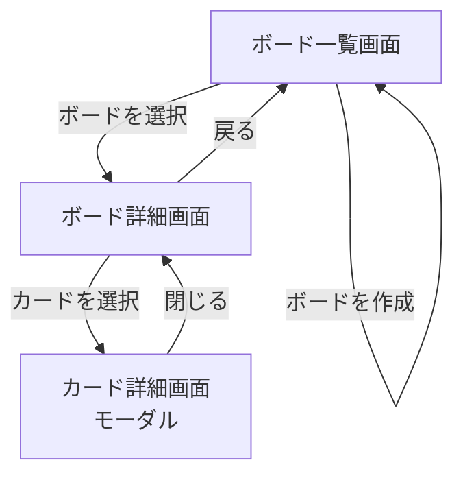

# 画面設計書

## 画面一覧

| 画面名 | 説明 |
|--------|------|
| ボード一覧画面 | 作成したボードを一覧表示する |
| ボード詳細画面 | リストとカードを表示・操作する |
| カード詳細画面 | カードの説明・期限・ラベルを編集する（モーダル） |

---

## 画面遷移図

### 遷移フロー



### 画面一覧と遷移元・遷移先

| 画面名 | 遷移元 | 遷移先 |
|--------|--------|--------|
| ボード一覧画面 | アプリ起動時（初期画面） | ボード詳細画面 |
| ボード詳細画面 | ボード一覧画面 | カード詳細画面 / ボード一覧画面 |
| カード詳細画面 | ボード詳細画面 | ボード詳細画面（モーダルを閉じる） |

### 各画面の主な操作

#### ボード一覧画面
- ボードの作成
- ボードの削除
- ボード名の編集
- ボードを選択してボード詳細画面へ遷移

#### ボード詳細画面
- リストの作成・削除・名前編集
- カードの作成・削除
- カードのドラッグ＆ドロップによるリスト間移動
- カードを選択してカード詳細画面（モーダル）を開く
- ボード一覧画面へ戻る

#### カード詳細画面（モーダル）
- カードタイトルの編集
- 説明文の追加・編集
- 期限日の設定・編集
- ラベルの追加・削除
- モーダルを閉じてボード詳細画面へ戻る

> - カード詳細画面は独立したページではなく、ボード詳細画面上に重なる**モーダル（ポップアップ）**として表示する
> - アプリ起動時はボード一覧画面を初期表示とする
> - ブラウザの戻るボタンは考慮しない（画面内の「戻る」ボタンで操作する）

---

## ワイヤーフレーム

### 1. ボード一覧画面

```
+--------------------------------------------------------+
| FirstTaskManager                                        |
+--------------------------------------------------------+
|                                                        |
|  ボード一覧                              [+ 新規ボード] |
|                                                        |
|  +----------------+  +----------------+               |
|  | 仕事           |  | プライベート   |               |
|  |                |  |                |               |
|  | [編集] [削除]  |  | [編集] [削除]  |               |
|  +----------------+  +----------------+               |
|                                                        |
+--------------------------------------------------------+
```

**操作：**
- `[+ 新規ボード]` ボタンでボード名入力欄を表示し、作成
- ボードカードをクリックでボード詳細画面へ遷移
- `[編集]` でボード名をインライン編集
- `[削除]` で確認ダイアログを表示後、削除

---

### 2. ボード詳細画面

```
+------------------------------------------------------------------+
| ← 戻る  |  仕事ボード                                            |
+------------------------------------------------------------------+
|                                                                  |
|  +---------------+  +---------------+  +---------------+        |
|  | Todo          |  | In Progress   |  | Done          |  [+]   |
|  | [編集] [削除] |  | [編集] [削除] |  | [編集] [削除] |        |
|  +---------------+  +---------------+  +---------------+        |
|  | タスクA       |  | タスクC       |  | タスクE       |        |
|  | 🏷 赤         |  | 🏷 青         |  |               |        |
|  +---------------+  +---------------+  +---------------+        |
|  | タスクB       |  |               |  |               |        |
|  | 期限: 5/20    |  |               |  |               |        |
|  +---------------+  +---------------+  +---------------+        |
|  [+ カードを追加]   [+ カードを追加]   [+ カードを追加]         |
|                                                                  |
+------------------------------------------------------------------+
```

**操作：**
- `← 戻る` でボード一覧画面へ戻る
- `[+]` で新しいリストを追加
- カードをドラッグ＆ドロップでリスト間を移動
- カードをクリックでカード詳細モーダルを開く
- `[+ カードを追加]` でカードタイトル入力欄を表示し、作成
- リストの `[編集]` でリスト名をインライン編集
- リストの `[削除]` で確認ダイアログを表示後、削除

---

### 3. カード詳細画面（モーダル）

```
+--------------------------------------------------------+
|                                          [× 閉じる]    |
|  タスクA                                               |
|  --------------------------------------------------------|
|                                                        |
|  タイトル                                              |
|  +--------------------------------------------------+  |
|  | タスクA                                          |  |
|  +--------------------------------------------------+  |
|                                                        |
|  説明                                                  |
|  +--------------------------------------------------+  |
|  | ここに説明を入力...                               |  |
|  |                                                  |  |
|  +--------------------------------------------------+  |
|                                                        |
|  期限日                                                |
|  +--------------------------------------------------+  |
|  | 2025/05/20                          📅            |  |
|  +--------------------------------------------------+  |
|                                                        |
|  ラベル                                                |
|  [🔴 緊急] [🔵 確認待ち] [+ ラベルを追加]             |
|                                                        |
|                               [保存] [キャンセル]      |
+--------------------------------------------------------+
```

**操作：**
- `[× 閉じる]` または `[キャンセル]` でモーダルを閉じる（変更破棄）
- `[保存]` で変更を保存してモーダルを閉じる
- タイトルが空の場合は `[保存]` を非活性にする
- `[+ ラベルを追加]` でラベル選択UIを表示
- ラベルの `×` でラベルを削除

> - モーダル表示中は背景（ボード詳細画面）をオーバーレイで暗くする
> - レスポンシブ対応は今回対象外（PC表示のみ）
