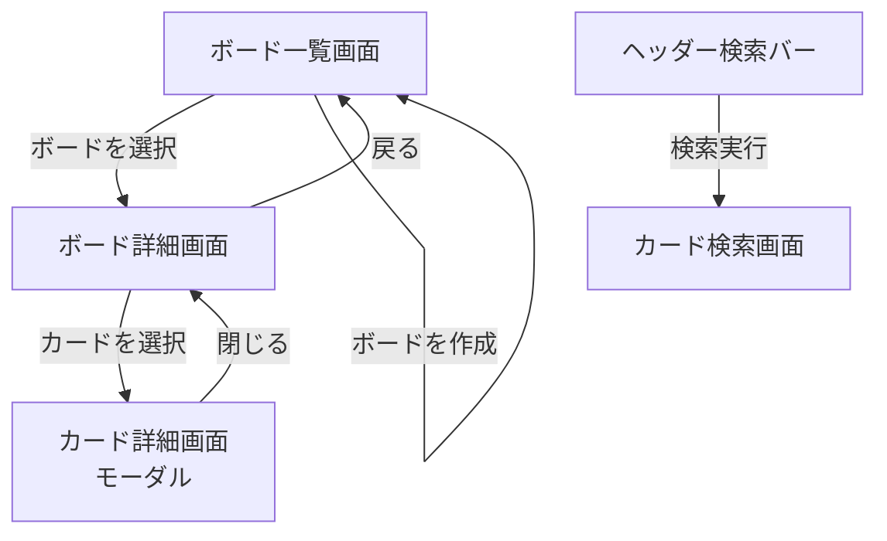

# 画面設計書

## 画面一覧

| 画面名 | 説明 |
|--------|------|
| ボード一覧画面 | 作成したボードを一覧表示する |
| ボード詳細画面 | リストとカードを表示・操作する |
| カード詳細画面 | カードの説明・期限・リスト移動・削除を操作する（モーダル） |
| カード検索画面 | キーワードでカードを横断検索する |

---

## 画面遷移図

### 遷移フロー



### 画面一覧と遷移元・遷移先

| 画面名 | 遷移元 | 遷移先 |
|--------|--------|--------|
| ボード一覧画面 | アプリ起動時（初期画面） | ボード詳細画面 |
| ボード詳細画面 | ボード一覧画面 | カード詳細画面 / ボード一覧画面 |
| カード詳細画面 | ボード詳細画面 / カード検索画面 | ボード詳細画面（モーダルを閉じる） |
| カード検索画面 | ヘッダーの検索バー | なし（終端画面） |

### 各画面の主な操作

#### ボード一覧画面
- ボードの作成（「+ 新規ボード」ボタン）
- ボードの削除（ボードカードにホバーすると表示される × ボタン、確認ダイアログあり）
- ボードを選択してボード詳細画面へ遷移
- ⬜ ボード名の編集

#### ボード詳細画面
- リストの作成（「+ リストを追加」ボタン）
- リストの削除（リストヘッダーにホバーすると表示される × ボタン、確認ダイアログあり）
- カードの作成（「+ カードを追加」ボタン）
- カードのドラッグ＆ドロップによるリスト間移動・同一リスト内並べ替え
- カードを選択してカード詳細画面（モーダル）を開く
- ボード一覧画面へ戻る
- ⬜ リスト名の編集

#### カード詳細画面（モーダル）
- カードタイトルの編集
- 説明文の追加・編集
- 期限日の設定・編集
- 別リストへの移動（リスト選択セレクトボックス）
- カードの削除（「削除」ボタン、確認ダイアログあり）
- モーダルを閉じてボード詳細画面へ戻る（「閉じる」ボタン / Escキー / オーバーレイクリック）
- ⬜ ラベルの追加・削除

#### カード検索画面
- ヘッダーの検索バーにキーワードを入力して検索
- 検索結果カード一覧を表示（タイトル・説明文の部分一致）

> - カード詳細画面は独立したページではなく、ボード詳細画面上に重なる**モーダル（ポップアップ）**として表示する
> - アプリ起動時はボード一覧画面を初期表示とする
> - ブラウザの戻るボタンは考慮しない（画面内の「戻る」ボタンで操作する）

---

## ワイヤーフレーム

### 1. ボード一覧画面

```
+--------------------------------------------------------+
| FirstTaskManager     [検索バー]          [検索]         |
+--------------------------------------------------------+
|                                                        |
|  ボード一覧                              [+ 新規ボード] |
|                                                        |
|  +----------------+  +----------------+               |
|  | 仕事        [×]|  | プライベート[×]|               |
|  |                |  |                |               |
|  +----------------+  +----------------+               |
|  ※ [×] はホバー時のみ表示                              |
|                                                        |
+--------------------------------------------------------+
```

**操作：**
- `[+ 新規ボード]` ボタンでボード名入力欄を表示し、作成
- ボードカードをクリックでボード詳細画面へ遷移
- ボードにホバーすると `[×]` ボタンが表示され、クリックで確認ダイアログ後に削除

---

### 2. ボード詳細画面

```
+------------------------------------------------------------------+
| ← 戻る  |  仕事ボード                  [検索バー]   [検索]       |
+------------------------------------------------------------------+
|                                                                  |
|  +---------------+  +---------------+  +---------------+  [+]  |
|  | Todo       [×]|  | In Progress[×]|  | Done       [×]|       |
|  +---------------+  +---------------+  +---------------+        |
|  | タスクA       |  | タスクC       |  | タスクE       |        |
|  | 期限: 5/20    |  |               |  |               |        |
|  +---------------+  +---------------+  +---------------+        |
|  | タスクB       |  |               |  |               |        |
|  +---------------+  +---------------+  +---------------+        |
|  [+ カードを追加]   [+ カードを追加]   [+ カードを追加]         |
|                                                                  |
+------------------------------------------------------------------+
```

**操作：**
- `← 戻る` でボード一覧画面へ戻る
- `[+]` で新しいリストを追加
- カードをドラッグ＆ドロップでリスト間移動・並べ替え
- カードをクリックでカード詳細モーダルを開く
- `[+ カードを追加]` でカードタイトル入力欄を表示し、作成
- リストにホバーすると `[×]` ボタンが表示され、クリックで確認ダイアログ後に削除（配下カードも全削除）

---

### 3. カード詳細画面（モーダル）

```
+--------------------------------------------------------+
| カードの詳細                             [× 閉じる]    |
+--------------------------------------------------------+
|                                                        |
|  タイトル                                              |
|  +--------------------------------------------------+  |
|  | タスクA                                          |  |
|  +--------------------------------------------------+  |
|                                                        |
|  説明                                                  |
|  +--------------------------------------------------+  |
|  | ここに説明を入力...                               |  |
|  |                                                  |  |
|  +--------------------------------------------------+  |
|                                                        |
|  期限日時                                              |
|  +--------------------------------------------------+  |
|  | 2025/05/20 10:00                      📅          |  |
|  +--------------------------------------------------+  |
|                                                        |
|  リスト（現在: Todo）                                  |
|  +--------------------------------------------------+  |
|  | Todo              ▼                              |  |
|  +--------------------------------------------------+  |
|                                                        |
+--------------------------------------------------------+
| [削除]                           [保存]  [閉じる]      |
+--------------------------------------------------------+
```

**操作：**
- `[×]` または `[閉じる]` でモーダルを閉じる（未保存変更は破棄）
- `Esc` キーでモーダルを閉じる
- オーバーレイ（背景の暗い部分）クリックでモーダルを閉じる
- `[保存]` で変更を保存してモーダルを閉じる（タイトルが空の場合は非活性）
- `[削除]` で確認ダイアログ後にカードを削除してモーダルを閉じる
- リスト選択セレクトボックスで別リストへ移動できる

> - モーダル表示中は背景（ボード詳細画面）をオーバーレイで暗くする
> - レスポンシブ対応は今回対象外（PC表示のみ）

---

### 4. カード検索画面

```
+--------------------------------------------------------+
| FirstTaskManager     [タスク]            [検索]         |
+--------------------------------------------------------+
|                                                        |
|  「タスク」の検索結果（3件）                            |
|                                                        |
|  +------------------+  +------------------+           |
|  | タスクA          |  | タスクB          |           |
|  | ここに説明...     |  |                  |           |
|  | 期限: 2025/5/20  |  |                  |           |
|  +------------------+  +------------------+           |
|                                                        |
+--------------------------------------------------------+
```

**操作：**
- ヘッダーの検索バーにキーワードを入力し `[検索]` ボタンまたは Enter で検索
