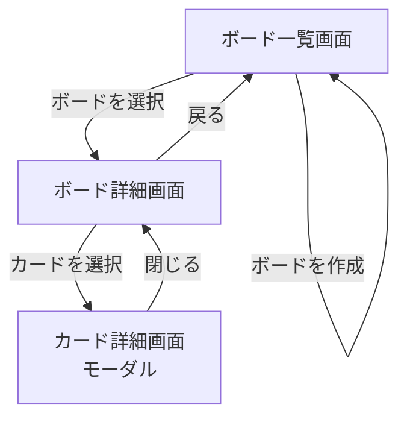

# 画面遷移図

## 遷移フロー

---

## 画面一覧と遷移元・遷移先

| 画面名 | 遷移元 | 遷移先 |
|--------|--------|--------|
| ボード一覧画面 | アプリ起動時（初期画面） | ボード詳細画面 |
| ボード詳細画面 | ボード一覧画面 | カード詳細画面 / ボード一覧画面 |
| カード詳細画面 | ボード詳細画面 | ボード詳細画面（モーダルを閉じる） |

---

## 各画面の主な操作

### ボード一覧画面
- ボードの作成
- ボードの削除
- ボード名の編集
- ボードを選択してボード詳細画面へ遷移

### ボード詳細画面
- リストの作成・削除・名前編集
- カードの作成・削除
- カードのドラッグ＆ドロップによるリスト間移動
- カードを選択してカード詳細画面（モーダル）を開く
- ボード一覧画面へ戻る

### カード詳細画面（モーダル）
- カードタイトルの編集
- 説明文の追加・編集
- 期限日の設定・編集
- ラベルの追加・削除
- モーダルを閉じてボード詳細画面へ戻る

---

## 備考

- カード詳細画面は独立したページではなく、ボード詳細画面上に重なる**モーダル（ポップアップ）**として表示する
- アプリ起動時はボード一覧画面を初期表示とする
- ブラウザの戻るボタンは考慮しない（画面内の「戻る」ボタンで操作する）
